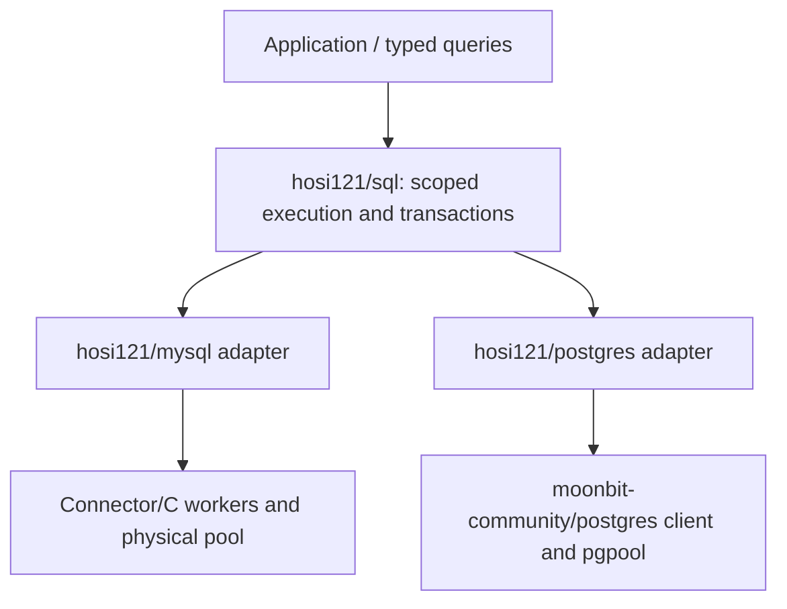

# Database abstraction: implemented boundary

Status: **experimental implementation**, validated with MySQL 8.4 and PostgreSQL
17. The initial extraction provided a MySQL-specific pool. The common API was
missing work, not a demonstrated reason to reject abstraction. It now exists as
`hosi121/sql` and is used by both adapters and the SpeakUp native consumer.

## What is shared

| Layer | Implemented contract | Deliberately separate |
| --- | --- | --- |
| Execution | query / execute / run with typed parameters, rows and metadata | SQL syntax/placeholders and codecs |
| Lifetime | One callback owns one session; expired/concurrent operations are rejected | Physical connect/close/recycle |
| Transaction | Read/decide/write callback, commit or rollback, cleanup on cancellation | Isolation/options and engine semantics |
| Admission | Bounded admitted requests, checkout timeout, observable counts | Actual connection pool and create/recycle I/O |
| Failure | No write retry, preserved causes, conservative unknown-commit outcome | SQLSTATE/server codes and retry decisions |
| Rows | Ordered columns, checked name lookup | Backend types, metadata and decoding |

This is execution/ownership portability, not query/schema portability. MySQL
`CLIENT_FOUND_ROWS`, unsigned integers and insert IDs do not acquire PostgreSQL
semantics by sharing a method name. PostgreSQL `RETURNING` remains returned rows.
SQLite, SQL translation, ORM relationships and generated schema types are not
implemented.

## Types and adapter integration

The public type is `Database[P, R, M, O]`, where P/R/M/O are the driver's parameter,
row, command-metadata and transaction-options types. `Session[P, R, M]` is valid
only inside its callback. The adapter SPI is `Driver[C, P, R, M, O]`; typed
closures capture C without `Any`, JSON normalization or unchecked generic casts.

MySQL supplies its `Value`, ordered `Row`, `Command` and `TransactionOptions`.
PostgreSQL supplies typed upstream `ToSql` parameters, a checked row wrapper,
`QuerySummary` and upstream transaction options. PostgreSQL NUMERIC values are
not silently approximated as Double. A common scalar union was unnecessary for
the two actual consumers and would have hidden useful codec differences.

`Driver.acquire/release/close` delegate pooling. SQL admission counts active and
acquiring requests but maintains no second connection pool. PostgreSQL uses
[`moonbit-community/postgres@0.0.8`](https://github.com/moonbit-community/postgres.mbt/tree/a0e4097af3f40444bd1e997ede672ba4adaf05ad)
from Mooncakes, whose resolved public interfaces were checked against the
inspected source. No new PostgreSQL protocol or foreign worker was written.

This resembles the separation of concrete database types in
[`sqlx::Database`](https://docs.rs/sqlx/latest/sqlx/trait.Database.html), without
translating that API mechanically. A common lifecycle does not require an ORM,
and shared SQL text is a different problem.

## Cancellation, cleanup and actual differences

Cancellation bypasses ordinary catch on the pinned MoonBit runtime. The first
real-DB runs exposed leaked leases when cleanup lived only in catch. Cleanup now
runs in cancellation-protected `errdefer`; this is covered by a deterministic
unit test and the same real-DB suite for both drivers.

Both adapters currently drain submitted SQL rather than cancel it at the server.
A deadline can therefore be exceeded while cleanup finishes. Callback cancellation
rolls back a transaction; autocommit writes may already have completed. Failed
commit completion produces `CommitOutcomeUnknown(cause)`, discards the connection,
and never retries. Rollback/reset failures retain causes and retire unsafe state.

MySQL uses `mysql_reset_connection`, then reapplies configured Unicode charset
and timezone. It closes the physical connection on a query failure and disallows
further operations in that failed scope. Adapter-generated transaction control
uses a separate Connector/C worker operation because MySQL's prepared-statement
protocol rejects some control commands. User query errors are not retried through
another protocol.

PostgreSQL delegates recycling to upstream Clean mode, with an explicit ROLLBACK
hook for an unmanaged transaction. Its background task group must outlive the
pool and borrowed scopes; `with_database` owns that lifetime. No cancel token
escapes the adapter, so an expired caller has no way to cancel a later borrower.

A callback must join its concurrent work. If it returns while an operation is
running, the facade invalidates the session, drains the operation, and rejects
successful commit/reuse of that unfinished scope. Closing a database rejects new
and queued borrowers but allows already borrowed scopes to finish.

## Evidence and limits

[`examples/conformance`](../examples/conformance/src/contract.mbt) contains one
generic suite. Only dialect strings, options, parameter encoders, row decoders
and expected constraint diagnostics vary. Both real engines exercise:

- session pinning and invalidation after callback/transaction;
- result-dependent transaction branches, commit and callback/SQL-error rollback;
- cancellation in SQL, between queries, and while waiting for checkout;
- checkout timeout, saturation and restored admission after cancellation;
- concurrent-operation rejection, session-setting and temporary-table cleanup;
- close with an active lease and waiting borrower, followed by observed cleanup.

Shared fault tests cover failed commit response, failed rollback/release,
swallowed query errors, cancellation, and an unjoined operation. Driver tests
cover native integer/binary values, duplicate columns, bounded collected results,
MySQL insert metadata, and PostgreSQL RETURNING/diagnostics. Independent consumer
builds verify PostgreSQL/WebSocket binaries do not link MariaDB.

These tests do not establish faster execution, arbitrary SQL portability, TLS
correctness, production failover, or a hard total-memory bound. In particular,
PostgreSQL's result limits do not bound the upstream protocol's buffering.
Resetting session state has a cost; callers can group operations in one scoped
session. This change has not been benchmarked against Go or the previous pool.

## Next adapters and integration

[`mizchi/sqlite.mbt`](https://github.com/mizchi/sqlite.mbt/tree/2758ae427e2afd640bfe9c5a24885bdf0efaf0ad)
is a candidate SQLite building block. Its native calls are synchronous; an async
function alone would still block the event loop. A worker must copy jobs/results
rather than pass MoonBit-managed memory to another thread. SQLite's one-writer
transaction behavior remains an adapter concern, not an excuse to omit the
shared execution layer.

[`mizchi/sqlc_gen_moonbit`](https://github.com/mizchi/sqlc_gen_moonbit/tree/8fa8213b1b4eb33325e5c5045d330daf11eade2d)
can complement this runtime with query-specific parameter/result types. A native
MySQL generator adapter and integration with this facade remain unimplemented.
The runtime does not require replacing the existing generator. SpeakUp's DTOs
stay shared across MoonBit native/JS; database connections and row internals do
not cross the JS ABI.
