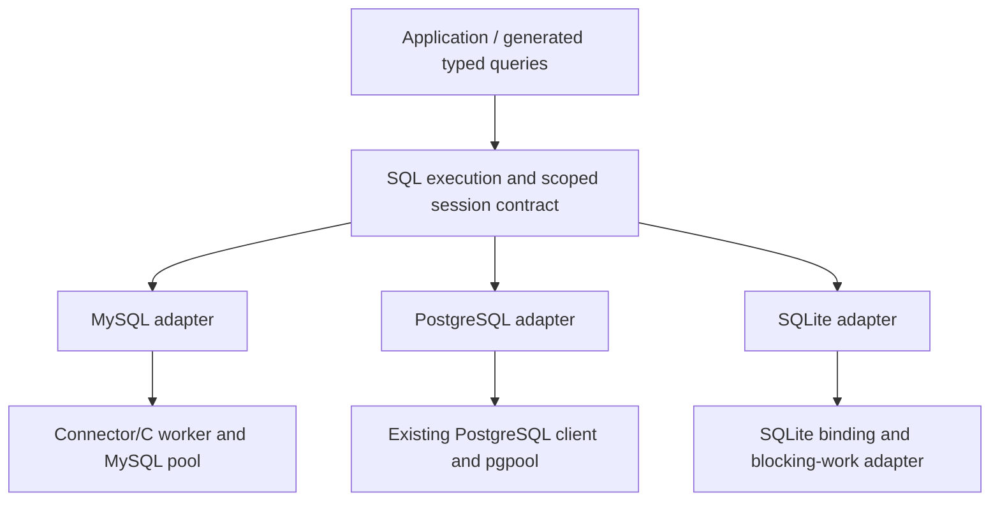

# Database abstraction: assessment and proposed direction

Status: **design proposal, not an implemented API**. Current runtime code still
supports MySQL only. No new driver or dependency was added during this review.

## Conclusion

The missing RDBMS abstraction was unfinished work, not a demonstrated reason to
reject abstraction. The first extraction combined a MySQL driver, connection
ownership, and query-result representation. It made that combination independently
buildable. It did not make the combination portable.

A shared database execution/lifetime layer is worthwhile. Keep SQL dialects,
codecs, and protocol machinery explicit. Validate the boundary with the existing
MoonBit PostgreSQL implementation as a second real adapter before treating it as
a stable shared API. This is the next design exercise, not a claim that adding an
empty driver interface alone solves reuse.

## Three different kinds of reuse

| Level | What can be shared | Current evidence |
| --- | --- | --- |
| Within one RDBMS | Prepared queries and pool safety across different applications | MySQL consumer and SpeakUp use the same implementation |
| Across RDBMSs | Scoped sessions, typed query operations, transaction lifetime, cleanup contracts | Not implemented; the shape and existing upstream APIs have been inspected |
| Across SQL dialects | The same application queries/schema on different databases | Not provided by a driver interface; requires backend-specific SQL or a separate query-generation layer |

The second level does not imply an ORM. Go's
[`database/sql`](https://pkg.go.dev/database/sql) demonstrates a common driver
surface and pooling. We should not copy its dynamically typed argument surface
into this project. Rust's
[`sqlx::Database`](https://docs.rs/sqlx/latest/sqlx/trait.Database.html) instead
retains driver-specific connection, arguments, row, and result types. Its type
separation is a useful reference, not an API to translate mechanically into
MoonBit.

## Proposed layers



The boxes above are a proposal. Only the MySQL path currently exists in this
repository. The public SQL facade should share operation and ownership contracts.
An internal reusable pool implementation may serve adapters that need one, but
adapters may delegate to an existing pool; do not require a pool inside a pool.

| Common contract | Driver responsibility |
| --- | --- |
| Borrow a session for one scope; reject use after release | Physical connect/reset/close and health checking |
| `query` returns rows; `execute` returns execution metadata | SQL placeholders, parameter encoding, result decoding |
| A transaction pins one physical session and exposes a scoped executor | Begin/commit/rollback protocol, supported isolation/options |
| Cancellation never makes an unfinished session available to another borrower | Drain, server cancellation, reset, or discard needed to reach that condition |
| Pool close rejects new borrowers; cleanup and completion are observable | Finish or discard in-flight backend operations |
| Unsupported options produce explicit errors | Backend capabilities and diagnostic details |

Do not make one-thread-per-connection part of the common contract. PostgreSQL
supports asynchronous operation; even
[`libpq`](https://www.postgresql.org/docs/current/libpq-async.html) can submit and
consume queries without the synchronous worker model used here. The existing
MoonBit driver is an alternative to introducing libpq at all.
SQLite has synchronous work and
[different concurrency rules](https://www.sqlite.org/lang_transaction.html),
including one simultaneous write transaction. Those differences belong below
the shared session contract and in explicit options.

## Types without `Any`

Keep the concrete connection, parameter, row, and command-result types while
sharing orchestration. For example, this shape type-checks with the pinned
MoonBit 0.10.14 compiler:

```moonbit
pub(all) struct Driver[C, P, R, M] {
  query : async (C, String, Array[P]) -> Array[R]
  execute : async (C, String, Array[P]) -> M
  begin : async (C) -> Unit
  commit : async (C) -> Unit
  rollback : async (C) -> Unit
}
```

A generic `Session[P, R, M]` can capture `C` and this operation record in typed
closures. That shape was also checked in a temporary module. This verifies type
expressibility only: the sketch omits transaction options, session liveness,
cleanup, and error policy, and is not a public API commitment.

Start with backend-specific parameter and row types, plus explicit converters for
shared scalar types. Decide on any portable scalar subset by exercising two real
adapters. Do not silently round unsigned 64-bit values, decimals, timestamps, or
backend-specific types into `Double`, `String`, or `Json` to make signatures match.
SQL NULL and a missing/ambiguous column remain different errors/states.

An enum of SQL scalar values is not automatically schema typing. Query-specific
parameter/row structs can be generated by
[`mizchi/sqlc_gen_moonbit`](https://github.com/mizchi/sqlc_gen_moonbit).
Its backend adapters provide a useful integration point; its native MySQL backend
and compatibility with this proposed facade still need implementation and tests.
Public application DTOs can remain shared between MoonBit native and JS without
exporting connection handles or database row internals through the JS ABI.

## Problems in the current API that the redesign must address

1. `transaction(Array[Statement])` only returns the last result. A useful common
   API also needs a transaction callback that can read a result and decide the
   next operation while retaining the same session. Batch execution can remain
   a convenience on top.
2. `Row.values: Map[String, Value]` loses duplicate column names and column order.
   Preserve ordered columns and values; name lookup should diagnose ambiguity.
3. `QueryResult.insert_id: UInt64` and `CLIENT_FOUND_ROWS` encode MySQL assumptions.
   PostgreSQL's [`RETURNING`](https://www.postgresql.org/docs/current/sql-insert.html)
   returns rows; do not fabricate a universal insert ID or silently equate matched
   and changed row counts. Retain backend execution metadata where semantics differ.
4. Pool checkout, C ownership, parameter copying, SQL execution, and decoding are
   mixed in `mysql/src/pool.mbt`. Separate those responsibilities before replacing
   names with `Database` or adding switch statements for each engine.
5. UTC session initialization, charset, and found-row behavior are implicit choices
   inherited from the application. Expose/document them as MySQL options; they
   should not become defaults of a database-neutral interface.
6. The pool bounds connections but not waiting requests. A shared admission layer
   needs bounded waiters, a checkout timeout, and observable saturation. Connection
   count and query/result byte limits solve different resource problems.
7. Cancellation and commit failures require explicit outcome semantics. A canceled
   caller does not imply a rolled-back write; a lost commit response can leave the
   outcome unknown. Retain backend errors and never infer safe retry from a broad
   category alone. Do not return dirty or unfinished sessions to the pool.

SQL placeholder conversion is not a string replacement task: quoted strings,
comments, and operators can contain the same characters. Keep backend SQL or use
an actual parser/generator. SQL syntax portability is a separate layer.

## Which second adapter?

| Candidate | What it would test | Main cost |
| --- | --- | --- |
| PostgreSQL using the existing MoonBit client/pool | Different async machinery, typed parameters, row metadata, cancellation, interactive transactions | Mapping session lifetimes and existing pool behavior; extra MoonBit dependencies and a DB test service |
| SQLite using the existing binding | Embedded DB, synchronous work, contention, non-server configuration | A safe worker boundary for blocking calls; a generic pool must not pretend concurrent writers scale like server sessions |
| Another MySQL application or a fake driver | API usability or deterministic failure injection | Does not validate differences between database engines |

**Use PostgreSQL first.** The inspected
[`moonbit-community/postgres.mbt`](https://github.com/moonbit-community/postgres.mbt/tree/a0e4097af3f40444bd1e997ede672ba4adaf05ad)
already exposes scoped clients/transactions, streaming, and operation-scoped
cancellation. Its manifest uses async 0.22.1, but source inspection is not a
compatibility build. Reuse its pool through an adapter rather than implementing
the PostgreSQL protocol or another pool. This checks a materially different
backend and challenges the common boundary more than cloning the MySQL worker.

[`mizchi/sqlite.mbt`](https://github.com/mizchi/sqlite.mbt/tree/2758ae427e2afd640bfe9c5a24885bdf0efaf0ad)
is a sensible later adapter candidate. Its native calls are synchronous; putting
them in an `async fn` does not move work off the event loop. A foreign worker
cannot call a binding that reads MoonBit-managed memory. Account for copied
native jobs/results, handle ownership, and SQLite's
[threading configuration](https://www.sqlite.org/threadsafe.html) explicitly.

## Implementation sequence and acceptance criteria

1. Separate the current MySQL connection operations from pooling and decoding,
   keeping the existing application behavior and exact-value tests intact.
2. Implement a minimal scoped session/transaction facade and a PostgreSQL adapter
   together. Let the real API differences revise the facade before freezing it.
3. Run a shared conformance suite against both real engines, with driver-specific
   setup SQL and expected capability differences. Keep driver-specific precision,
   error, and transport tests alongside it.
4. Move the application consumer to the verified facade; evaluate sqlc integration
   and SQLite afterward. A facade that adds no reuse or forces lossy conversions
   must be revised, not declared successful merely because it compiles.

The shared suite must cover session pinning, callback commit/rollback, cancellation
while waiting and in flight, cleanup after failed rollback, pool close with active
leases, use-after-release, cross-request session contamination, and unchanged
results/precision. Cancellation of an old operation must never cancel the next
borrower's work. Add deterministic fault injection where real servers cannot
reliably reproduce commit/cleanup failures.

The result should let a new adapter reuse the ownership rules and conformance
tests while supplying its actual backend operations. Until that works with two
engines, describe the shared layer as experimental and the MySQL adapter as the
only implemented database support.
